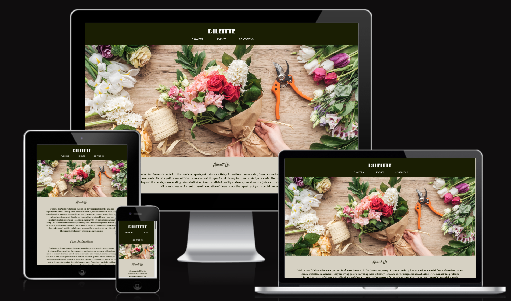

# Dileitte - A milstone Project



[View the live project here](https://dilsv.github.io/Dileitte1/)

## Table of contents
1. [Introduction](#Introduction)
2. [UX](#UX)
    1. [Ideal User Demographic](#Ideal-User-Demographic)
    2. [User Stories](#User-Stories)
    3. [Development Planes](#Development-Planes)
    4. [Design](#Design)
3. [Features](#Features)
    1. [Design Features](#Design-Features) 
    2. [Existing Features](#Existing-Features)
    3. [Features to Implement in the future](#Features-to-Implement-in-the-future)
4. [Issues and Bugs](#Issues-and-Bugs)
5. [Technologies Used](#Technologies-Used)
     1. [Main Languages Used](#Main-Languages-Used)
     2. [Frameworks, Libraries & Programs Used](#Frameworks,-Libraries-&-Programs-Used)
     

## Introduction

This website was designed to give access to people who want the experience of bespoke botanics without having to go out of their way to make a day special for their loved ones.

Although there are a wide variety of businesses that offer the same service, this website was built to not only offer people personalisation of flowers, but also offering pre-made designs to make their journey a little easier when making that special day more memorable.

This website could also have further commercial applications given there is a large market for botanics and smaller complimentary gifts.

This is the first of four Milestone Projects that the developer must complete during their Full Stack Web Development Program at The Code Institute. 

The main requirements were to make a responsive and static website with a minimum of three pages using primarily **HTML5** and **CSS3**.

[Back to top ⇧](#Dileitte)

## UX 

### Ideal User Demographic
#### The ideal user of this website is:
- Couples
- Events planners
- Businesses and offices
- Those with a general interest in plants and botanics

### User Stories
#### Someone with an interest for flowers:
1. As someone with an interest for flowers, I want to easily navigate through the website to find the relevant content.
3. As someone with an interest for flowers, I want to offer a vast choice of bouquets.
4. As someone with an interest for flowers, I want to be able to view options and arrangements for the occasion.
5. As someone with an interest for flowers, I want information that enables me to understand the different assortments and what each flower may represent, including care suggestions/instructions. 

#### Friends or parents of those who are interested in flowers:
1. As a friend or parent of someone with an interest for botanics, I want to easily navigate through the website to find the relevant content. 
2. As a friend or parent of someone with an interest for botanics, I want to learn how to maintain flowers for a longer period before the wilting process.
3. As a friend or parent of someone with an interest for botanics, I want to learn what product's go well together for complimentary purposes

### Development Planes
In order to create a comprehensive and informative website, the developer researched what similar websites included, asked people with experience in botanics what would be helpful and looked into personal experience. 

#### Strategy
Broken into three categories, the website will focus on the following target audiences:
- **Roles:**
     - People currently regularly involved with flowers
     - People with experience in floristry
     - People wanting to learn more about flowers

- **Demographic:**
     - 14 - 85 year olds
     - Primarily anthophiles (not exclusively)

- **Psychographics:**
     - Personality & Attitudes:
          - Detailed and orientated
          - Expressive and thoughtful
     - Values:
          - Celebrating milestones 
          - Supporting local businesses
     - Lifestyles:
          - Wellness and self-care advocates
          - Interested in detail and aesthetic

The website needs to enable the **user** to:
- Obtain desired information
- Gain insight on the different asortments
- Contact website host
- Find them on their preferred social media platform
- Provide an easily navigable website for users to find relevant information/products

The website needs to enable the **host** to:
- Develop an online presence 
- Reach the target demographic 
- Provide channel of communication for specific products and product providers

#### Scope
A scope was defined in order to clearly identify what needed to be done in order to align features with the strategy previously defined. This was broken into two categories:
- **Content Requirements**
     - The user will be looking for:
          - Flower care information
          - Product information
          - Supporting imagery/videos
          - Contact details
          - Social Links
- **Functionality Requirements**
     - The user will be able to:
          - Easily navigate through the site in order to find the information/product they want
          - Be able to find links to external sites in order to:
               - Explore other options
               - Be able to look at supporting content
               - Contact the website host via their chosen channel of communication

#### Structure
The information architecture was organized in a **hierarchial tree structure** in order to ensure that users could navigate through the site with ease and efficiency, with the following results: 

! [Sitemap] (assets/readme-files/tree-structure.png)

#### Skeleton 
Wireframe mockups were created in a [Balsamiq] (https://balsamiq.com/wireframes/) with providing a positive user experience in mind:

Home Page:
! [Home Page wireframe] (assets/readme-files/wireframe-home.png "Home Page wireframe")

Bio Page:
! [Flowers page] (assets/readme-files/wireframe-flowers.png "Flowers Page wireframe)

Press Kit Page:
! [Contact Us Page] (assets/readme-files/wireframe-contact-us.png)

### Design

#### Colour Scheme
The main colours used throughout the website are Eerie Black, Beaver with accents of Bone and Seasalt. 

These chosen colours were because they are typically found in nature, and are complementary to the natural colours of flowers and plants. They also provoke feelings of self-care and serenity.  

#### Typography
The pairing of the fonts [Volkorn](https://fonts.google.com/specimen/Volkorn "Link to Volkorn Google Font") and [Montserrat](https://fonts.google.com/specimen/Montserrat "Link to Montserrat Google Font") is used throughout the website with Sans Serif as the fallback font in case of import failure. 

For features that needed to be highlighted, such as the logo text and subheadings, the font [Limelight](https://fonts.google.com/specimen/Limelight "Link to Limelight Google Font") and [Satisfy](http://fots.google.come/specimen/Satisfy "Link to Satisfy Google Font") was used, with Sans Serif as the fallback.

#### Imagery
The selected imagery is modern and cohesively aesthetic, reflecting the style and feel of the website. It is also supporting of any informative text presented. 

The imagery is catching and visually represents the theme of the website.

All imagery provides alternative text to be used in the event that the element cannot be rendered.

[Back to top ⇧](#Dileitte)

## Features

### Design Features
Each page of the website features a consistent responsive navigational system:
- The **Header** contains a conventionally placed **logo** in the top center of the page (whereby by clicking this will redirect users back to the home page) and **navigation bar** in the top center of the page.
- The **Footer** contains the appropriate **social media icons**, linking users to the appropriate social media site. On smaller screens the Footer decreases in size relative to the other elements on the page.
- On smaller screens, the navigation bar shrinks in size and remains in the center of the webpage.

### Testing 
--------------------------------

### Existing Features
- **Header Logo** - Appearing on every page for brand recognition. Clicking the logo will return the users to the home page, as expected.
- **Header Navigation Bar** - Appearing on every page for a consistently easy and intuitive navigable system.
- **Social Icons** - Appearing on every page in the footer, the icons are appropriate representations of the Social Media platforms, linking to preferred social media platform. 
- **Contact Form** - A contact form is used on the Contact us page, in order to provide a point of contact for the user. The form is not valid and on pressing submit the form will reset.

- **[Home Page](index.html "Home Page")** - Provide an eyecatching home image, with relevant information on who the website host is and what the website is about. 
- **[Flowers Page](flowers.html "Flowers Page")** - Providing imagery on the different asortments and protection availible for this type of interest.
- **[Contact Us Page](contact.html "Contact Us Page")** - Providing a simple form to allow the user to contact the website host.

### Features to include in the future

- **Product Shop**
     - **Feature** - Set up a section where the user is able to build personalised assortments.
     - **Reason for not featuring in this release** - Need a wider variety of images or description of other flowers and plants.
- **Product Information and pricing** 
     - **Feature** - Set up a section beneath the flower images that provides pricing and the unique names of the bouquets.
     - **Reasons for not featuring in this release** - Need a detailed description for each flower featured in the bouquets as well as average pricing for specific styles.
- **Events Page Contents**
     - **Feature** - Set up a page that offers a wider range of events the website caters so users can get a better understnading of the services offered.
     - **Reasons for not featuring in this release** - Need a lot more visual aid to show examples of events and flower assortments for each event offered. To do this the developer needed to source pictures of multiple event photos from porfessional websites to add.

     [Back to top ⇧](#Dileitte)

     ## Issues and Bugs 
The developer ran into a number of issues during the development of the websites, with the noteworthy ones listed below, along with solutions or ideas to implement in the future.

**Images Bug** - An inconsistency was detected later on with the images. On the page view some images were larger than others and weren't inline with eachother, making it less consistent. This wasn't solved as the images were different sizes by default. The solution to this is to keep images used the same size throughout to avoid incosistency.

**Social Links footer bug** - A bug was detected when adding the footer to the contact us page anf flowers page. The footer (social media icons) were inside the contact us form. This was solved by finding that there was a missing </div> that was causing the footer to be picked up in the body of the contact us form and adding </div> in the appropriate place. 

**Footer Issue on all pages** - A bug was detected when implementing the footer to be used for all pages. When looking on the ports the footer look disorientated and dimentions didn't reflect the codes in flowers.html and contact.html. [A `media query` was added however, it didnt give the desired result therefore the developer removed the footer colour in order to fix the bug]

**Contact Us form bug** - A bug was detected when testing the contact us form. You were able to put in one letter on the name field and you were also able to adjust the size of the comment box. This was fixed by adding a minimum character of 5 to the input fields giving the comment section a `resize: none;`.

**Media and Audio bug** - Upon uploading the youtube video the developer couldn't connect [This was fixed by implementing 'embed' within the url] however, the youtube media looks longer in length when the window is shrunk.

**Commits** - Whilst coding the developer had missed the important action of committing codes whilst building the webpage, when making small and substantial changes.

**Repository and Workspaces** - The developer had set up their workspaces incorrectly, only realising last minute as Gitpod began asking for billing information. The developer contacted tutor support and they helped carry the workspaces over however, due to the codes not being pushed even though they were committed, the repository didnt reflect the pages and files. To tackle this, the developer had to rewrite the code in parts and make sure to commit and push regularly to make it reflect into the new repository.

**Readme Files** - Upon writing the read.me file, the developer started editing the read.me through the repository, which caused conflict between the workspace and repository as it didnt allow to git push the work done. This was fixed with the help of a mentor.

**Responsiveness** - The devloper has managed to make the website responsive for smaller and larger screens however, upon minimising and expanding the screen the pictures become skewed and disorientated.

[Back to top ⇧](#Dileitte)

## Technologies Used
### Main Languages Used
- [HTML5](https://en.wikipedia.org/wiki/HTML5 "Link to HTML Wiki")
- [CSS3](https://en.wikipedia.org/wiki/Cascading_Style_Sheets "Link to CSS Wiki")


### Frameworks, Libraries & Programs Used
- [Google Fonts](https://fonts.google.com/ "Link to Google Fonts")
    - Google fonts was used to import the fonts "Roboto", "Lato" and "Montserrat" into the style.css file. These fonts were used throughout the project.
- [Font Awesome](https://fontawesome.com/ "Link to FontAwesome")
     - Font Awesome was used on all pages throughout the website to import icons (e.g. social media icons) for UX purposes.
- [Git](https://git-scm.com/ "Link to Git homepage")
     - Git was used for version control by utilising the GitPod terminal to commit to Git and push to GitHub.
- [GitHub](https://github.com/ "Link to GitHub")
     - GitHub was used to store the project after pushing
- [Balsamiq](http://balsamiq/cloud/ "Link to Balsamiq Homepage")
     - Balsamiq was used to create wireframes during the design phase of the project. 

[Back to top ⇧](#Dileitte)

## Testing

Testing information can be found in a separate testing [file](TESTING.md "Link to testing file")

## Deployment

This project was developed using [Gitpod](https://www.gitpod.io/ "Link to Gitpod site"), committed to git and pushed to GitHub using the computer terminal.

### Deploying on GitHub Pages
To deploy this page to GitHub Pages from its GitHub repository, the following steps were taken:

1. Log into [GitHub](https://github.com/login "Link to GitHub login page") or [create an account](https://github.com/join "Link to GitHub create account page").
2. Locate the [GitHub Repository](https://dilsv.github.io/Dileitte1/ "Link to GitHub Repo").
3. At the top of the repository, select Settings from the menu items.
4. In the Settings page on the left click the "Pages" section.
5. Under "Source" click the drop-down menu labelled "None" and select "Main Branch".
6. Upon selection, click the save button, the page will automatically refresh meaning that the website is now deployed.
7. Sometimes it may not show the deploy therefore, click "Pages" section again to retrieve the deployed link; this will be visible on the top of the page.
8. At the time of submitting this Milestone project the Development Branch and Main Branch are identical.

### Forking the Repository
By forking the GitHub Repository we make a copy of the original repository on our GitHub account to view and/or make changes without affecting the original repository by using the following steps...

1. Log into [GitHub](https://github.com/login "Link to GitHub login page") or [create an account](https://github.com/join "Link to GitHub create account page").
2. Locate the [GitHub Repository](https://dilsv.github.io/Dileitte1/ "Link to GitHub Repo").
3. At the top of the repository, on the right side of the page, select "Fork"
4. You should now have a copy of the original repository in your GitHub account.

### Creating a Clone
How to run this project locally:
1. Install the [GitPod Browser](https://www.gitpod.io/docs/browser-extension/ "Link to Gitpod Browser extension download") Extension for Chrome.
2. After installation, restart the browser.
3. Log into [GitHub](https://github.com/login "Link to GitHub login page") or [create an account](https://github.com/join "Link to GitHub create account page").
2. Locate the [GitHub Repository](https://dilsv.github.io/Dileitte1/ "Link to GitHub Repo").
5. Click the green "GitPod" button in the top right corner of the repository.
This will trigger a new gitPod workspace to be created from the code in github where you can work locally.

How to run this project within a local IDE, such as VSCode:

1. Log into [GitHub](https://github.com/login "Link to GitHub login page") or [create an account](https://github.com/join "Link to GitHub create account page").
2. Locate the [GitHub Repository](https://dilsv.github.io/Dileitte1/ "Link to GitHub Repo").
3. Under the repository name, click "Clone or download".
4. In the Clone with HTTPs section, copy the clone URL for the repository.
5. In your local IDE open the terminal.
6. Change the current working directory to the location where you want the cloned directory to be made.
7. Type 'git clone', and then paste the URL you copied in Step 3.
```
git clone https://github.com/USERNAME/REPOSITORY
```
8. Press Enter. Your local clone will be created.

Further reading and troubleshooting on cloning a repository from GitHub [here](https://docs.github.com/en/free-pro-team@latest/github/creating-cloning-and-archiving-repositories/cloning-a-repository "Link to GitHub troubleshooting")

[Back to top ⇧](#Dileitte)

## Credits 
- I would like to thank Emma Charles-Wilson for the help on some of the codes and design bugs and also the bug fix for the youtube video.
- I would like to thank Harry Dhillon for his expert skills, helping with the larger issues faced within this Milestone Project, showing patience and teaching along the way.
- I would like to thank my friends and family for providing insite into how and if the website would work for them and if the content is clear.

### Content
- The text used in the About Us and Care Instructions section on the Main Page have been sourced from the developer.
- Photos in the Flowers Suggestion section were sourced from (https://www.moysesflowers.co.uk/) and (https://www.google.com)

### Media
- How to make fresh flowers last longer video was sourced from (https://www.youtube.com/watch?v=4dx9AKW_P88)
- All images from the flowers section images have been sourced from (https://www.moysesflowers.co.uk/) and all other images have been sourced from (https://www.google.com)

### Code 
The developer consulted multiple sites in order to better understand the code they were trying to implement. For code that was copied and edited, the developer made sure to reference this with the code. The following sites were used on a more regular basis:
- [W3Schools](https://www.w3schools.com/ "Link to W3Schools page")
- [Dileitte](https://8000-dilsv-dileitte-m4sl1micfeh.ws-eu105.gitpod.io/index.html "Link to Discover page")
- [W3C Markup Validation Service] (https://validator.w3.org/#validate_by_input "Link to W3C Validator page)

## Acknowledgements

- I would like to thank my friends and family and peers for their valued opinions and critic during the process of design and development.
- I would like to thank my Code Institute for their invaluable help and guidance throughout the process.

[Back to top ⇧](#Dileitte)

***