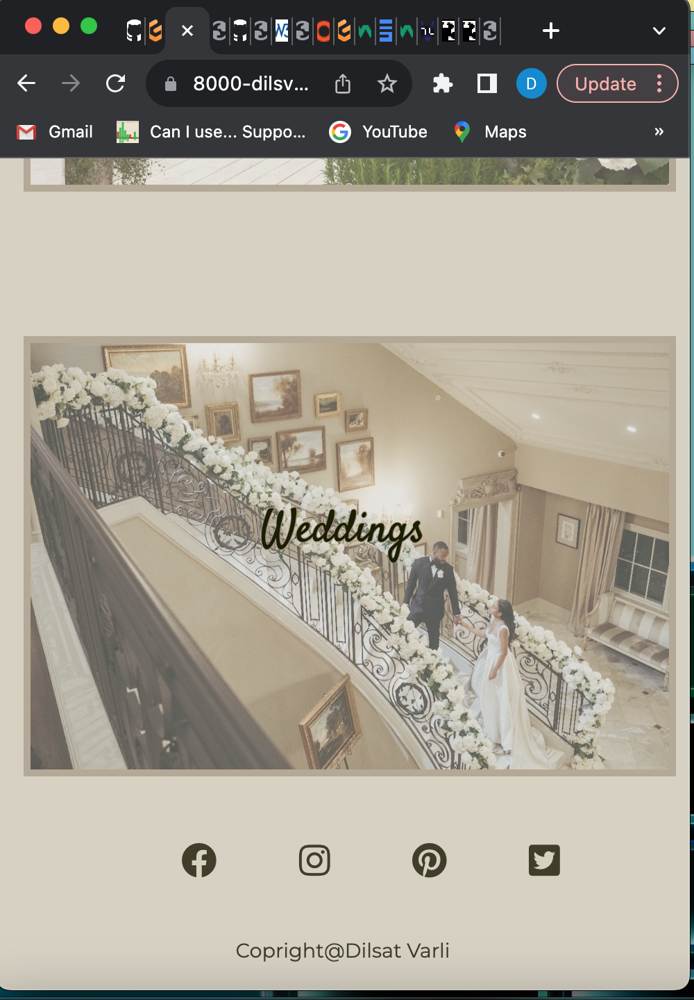
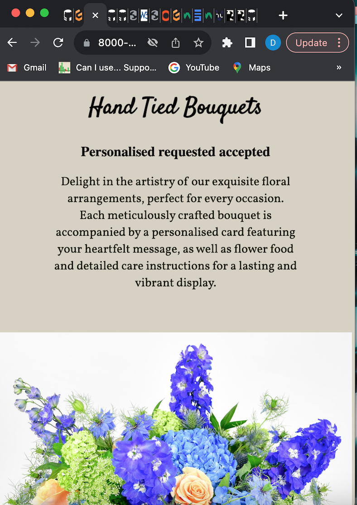
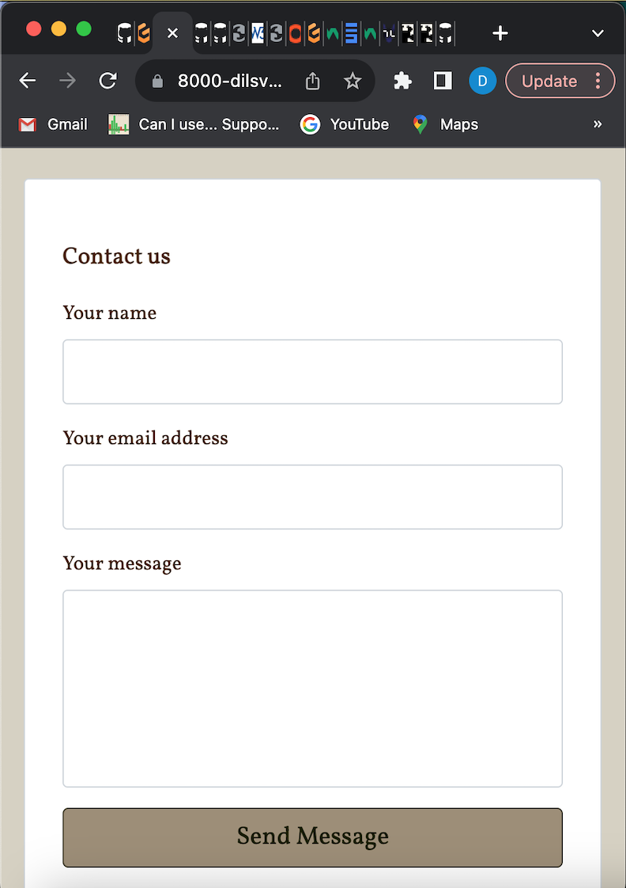
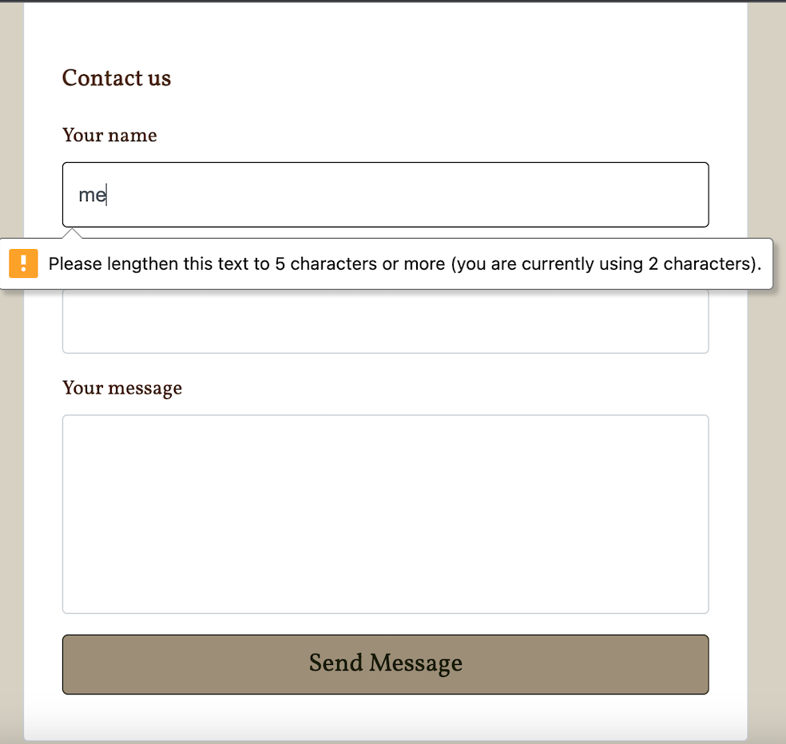
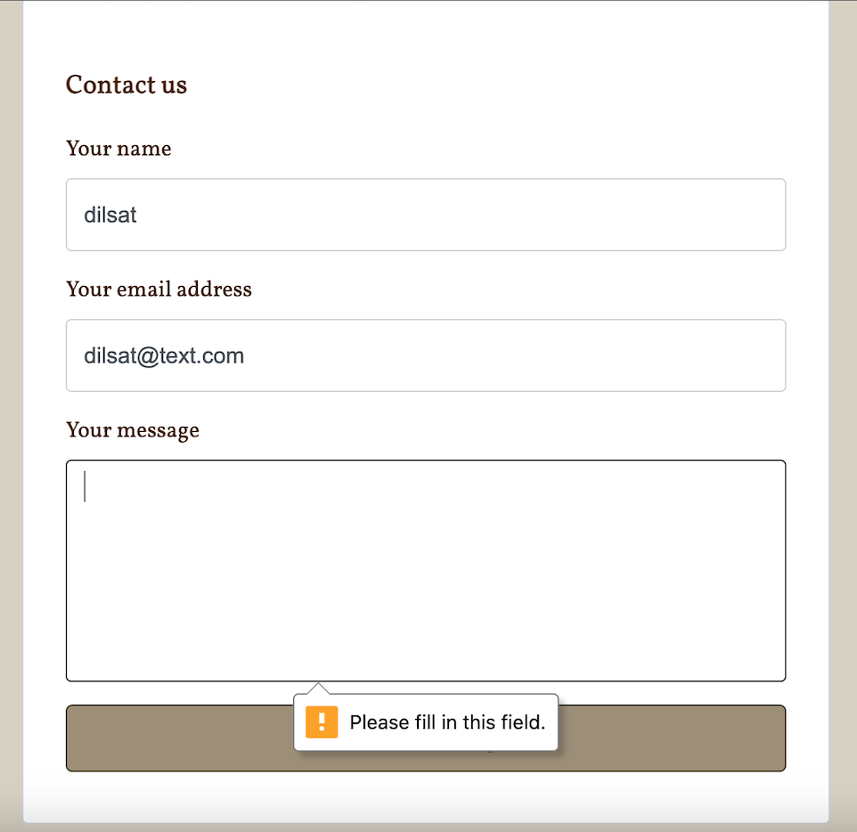
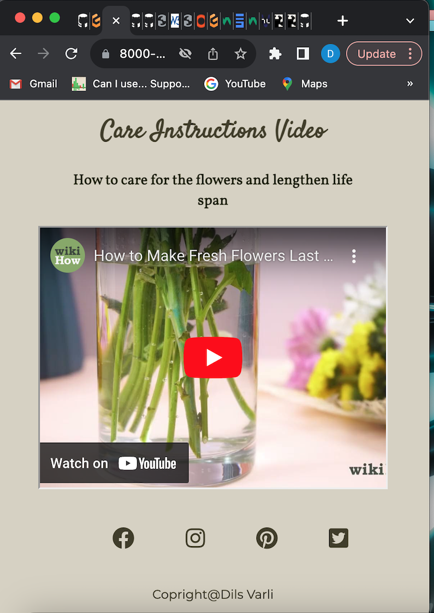

# Dileitte - Testing 

[Main README.md file](README.md)

[View live project](https://dilsv.github.io/Dileitte1/)

[View website in GitHub Pages](https://dilsv.github.io/Dileitte1/)

***
## Table of contents
1. [Testing User Stories](#Testing-User-Stories)
2. [Manual Testing](#Manual-Testing)
3. [Automated Testing](#Automated-Testing) 
     - [Code Validation](#Code-Validation)
     - [Browser Validation](#Browser-Validation)
4. [User Testing](#User-Testing)

***

## Testing User Stories

#### Someone with interest on floristry or flowers:
1. As someone with interest in flowers I want to easily navigate through the website.

     - The navigation bar is clearly defined and easily navigable for users to find and use.
     - The logo image on the top left of each page leads users back to the home page.
     - The footer menu is easy to use with appropriate icons for easy identification.

2. As someone with interest in flowers, I want a clear guide to identify what flowers are featured.

     - The 'Home' page clearly identifies what the business offers and features an About Us introduction and Care Instructions paragraph with media. 
     - The 'Home' page also includes imagery to support this content.

3. As someone with interest in flowers, I want to be able to view options of different flowers and bouquets.

     - The 'Flowers' page includes multiple bouquets with alternate text for an image on each one.
     - The 'Flowers' page also includes imagery to support this content. 

4. As someone with an interest in flowers, I want information that enables me to manage my hair effectively, including product suggestions. 

     - The 'Events' page includes visual imagery of supporting content. 
     - The 'Events' page has a list of three examples of the services provided. 
     - The 'Events' page also includes text on the photos.

#### Friends or parents of those who have interests in flowers:
1. As a friend or parent of someone who has a liking for flowers, I want to easily navigate through the website to find the relevant content. 

     - The menu items are clear and easy to understand allowing the user to easily navigate through the website. 

2. As a friend or parent of someone who likes flowers, I want to learn how to care for flowers upon receiving them.

     - The supporting text and videography used on the Regiment page is clear and easy to understand and impliment. 

3. As a friend or parent of someone who likes flowers, I want to learn what flowers complement eachother. 

     - The Flowers page includes a list of recommended flowers that compliment eachother in a mix of different bouquets .
     

[Back to top ⇧](#Dileitte---Testing)

## Manual Testing

### Home Page
Manual testing was conducted on the following elements of the [Home Page](index.html):

[iPad View Events Image](assets/readme-files/ipad-view-e)
[iPad View Flower Image](assets/readme-files/ipad-view-f)
[Mob View Contact Us Image](assets/readme-files/mob-view-c)
[Mob View Events Image](assets/readme-files/mob-view-e)
[Mob View Flowers Image](assets/readme-files/mob-view-f)
[Mob View Home Page Image](assets/readme-files/mob-view-m)

### Home Page
Manual testing was conducted on the following elements of the [Home Page](index.html):

- On mobile device, images and text should decrease in size and padding should decrease allowing more space for content 

     

### Events Page 
Manual testing was conducted on the following elements of the [Events Page](events.html):

- Clicking on the social media links will take the user to the social media pages, and the user will get the option to sign into the websites directly.

     

- On mobile device, product suggestion images should collapse into a block of four, two images on either row for UX purposes

     

- On mobile device, images and text should decrease in size and padding should decrease allowing more space for content

     

### Contact Us Page 
Manual testing was conducted on the following elements of the [Contact Us Page](contact.html):

- Clicking on the logo on the top center of the page will return the user to the Home Page 

     

- Form will prompt the user to fill out each input field or the form won't submit 

     

- Minimum of 5 charcaters will have to be entered or the form won't submit 

     

- On submitted the form the page will refresh 

     

- On mobile device, the form will increase in width to fill up the page 

     

[Back to top ⇧](#Kryan-Live---Testing)

## Automated Testing

The [W3C CSS Validator](https://jigsaw.w3.org/css-validator/) service was used to validate the `CSS` code used.

The [W3C Validator](https://validator.w3.org/) service was used to validate the `HTML` code used. 

**Results:** 

- Home Pgae 

     

- Protective Styles Page 

     

- Regimen Page 

     

- Contact Us Page 

     

### Browser Validation
- Chrome - [test image](assets/readme-files/chrome.png)
- Safari - [test image](assets/readme-files/safari.png)
- Firefox - [test image](assets/readme-files/firefox.png)

## User testing 
Friends and family members were asked to review the site and documentation to point out any bugs and/or user experience issues. Their helpful advice throughout the process led to many UX changes in order to create a better experience. 

It was through this testing that the following changes were made:
- Change the home image for mobile device so that the image fit and had a high resolution.
- Increase font size for desktop view for easy reading.
- Lighten background colour slightly for easy readability. 

[Back to top ⇧](#Discover3c---Testing)

***